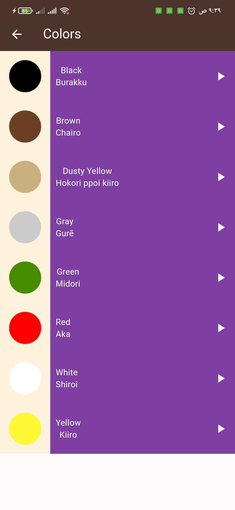
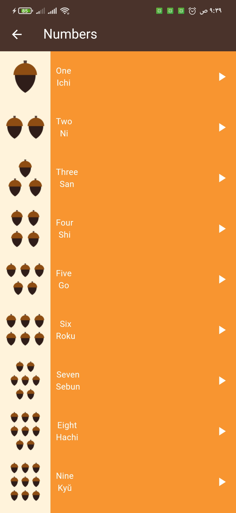
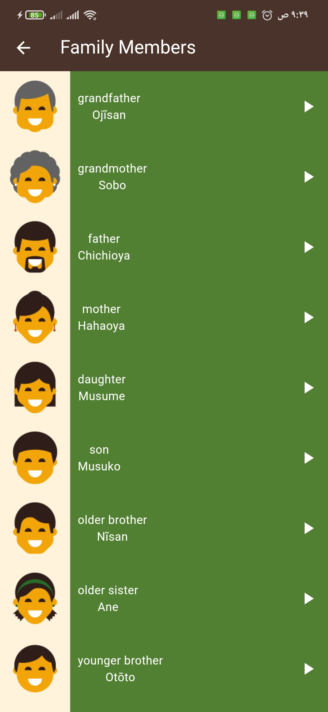

# Japanese Language Learning App 🇯🇵

A mobile application designed to help users learn the Japanese language, featuring audio recordings for numbers, colors, and commonly used phrases.

## 📱 Features

- 🔢 Learn Japanese numbers with pronunciation.
- 🎨 Learn Japanese colors with audio support.
- 👨‍👩‍👦‍👦 Learn Japanese Family Members with audio support.
- 💬 Common phrases used in daily conversations.
- 🎧 Audio support to improve pronunciation and listening skills.

## 🛠️ Technologies Used

- **Programming Language:** Dart (with Flutter framework)
- **Audio Handling:** `audioplayers` package
- **UI Design:** Flutter Widgets and Material Design


## 🖼️ Screenshots


### Colors Section
 
*Home screen showing categories and audio playback.*

### Numbers Section
  
*Learning numbers with audio support.*

### Colors Section
  
*Learning colors with Japanese pronunciation.*

### Family Members Section
  
*Learning Family Members with Japanese pronunciation.*

## 🖼️ Screensrecord

### Pharses Screen

https://github.com/user-attachments/assets/109a6020-e173-466b-9634-62f57b07ae08

*Listening popular pharses in japanes.*


## 📥 How to Run the App

Follow these steps to run the app on your local machine:

1. Clone the repository:
   ```bash
   git clone https://github.com/your-username/your-repo-name.git
